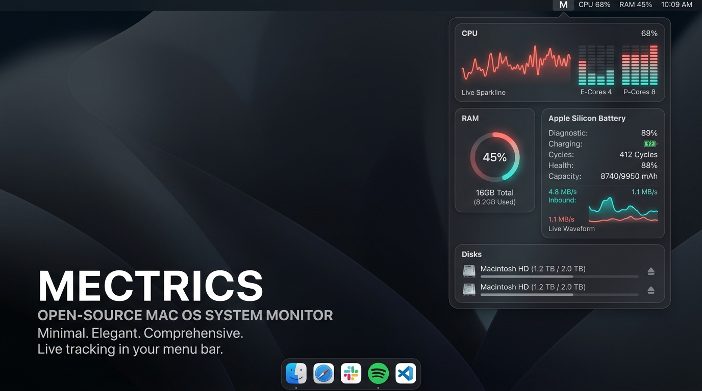
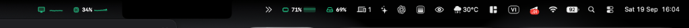
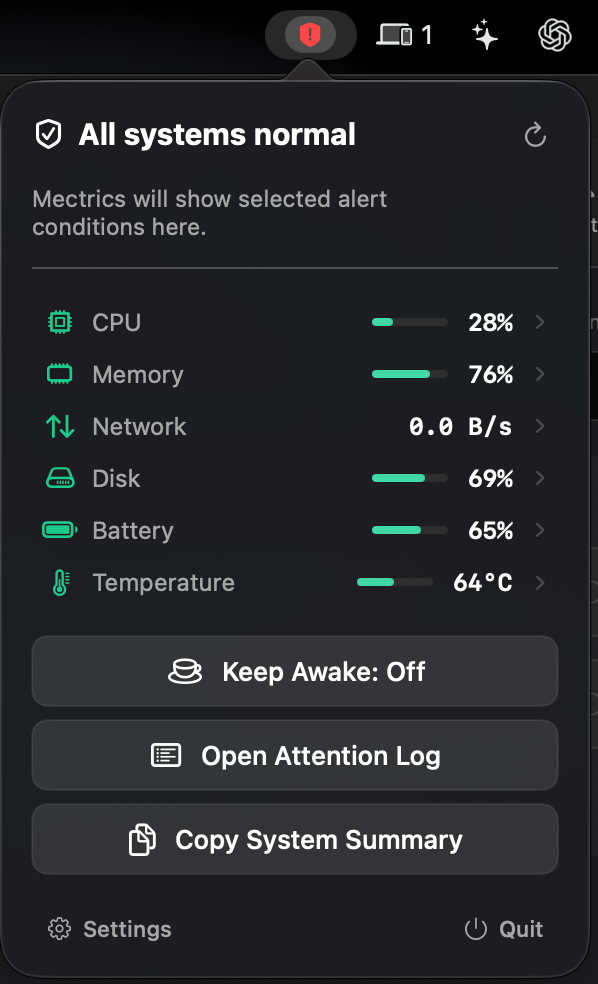
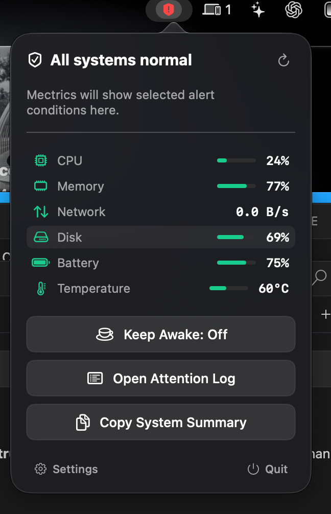
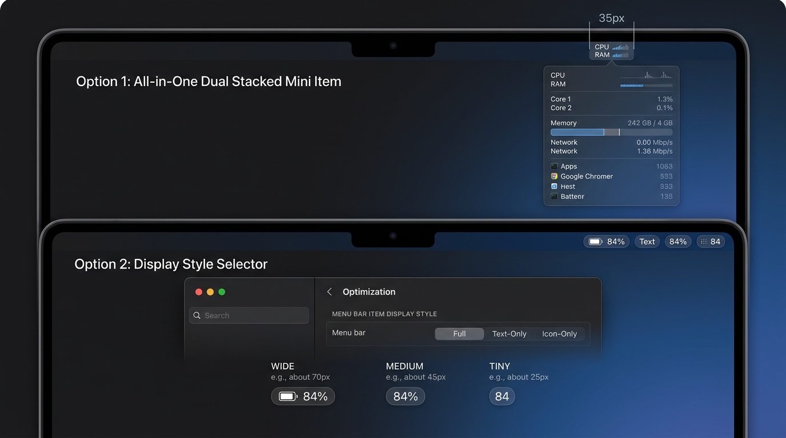
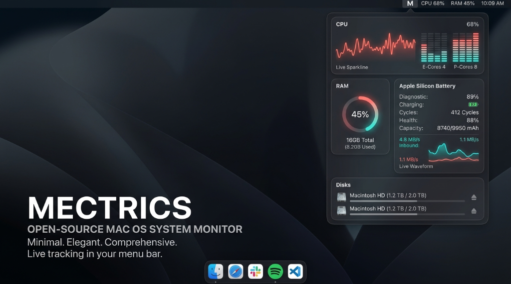

# Mectrics 📊⚡️
### Ultra-Lightweight, Privacy-First macOS System Monitor with Headless CLI

<p align="center">
  
</p>

<p align="center">
  <a href="#key-features"></a>
  <a href="#key-features"></a>
  <a href="#key-features"></a>
  <a href="#privacy--offline-guarantee"></a>
  <a href="https://www.buymeacoffee.com/ntb1nh" target="_blank"></a>
  <a href="LICENSE"></a>
</p>

---

## ⚡ Overview

**Mectrics** is an ultra-fast, native macOS system monitor crafted specifically for modern Apple Silicon and Intel Macs. Built with **Swift 6, SwiftUI, and AppKit**, Mectrics provides real-time visibility into your hardware directly from the menu bar with zero telemetry, zero background network listeners, and minimal CPU footprint.

<p align="center">
  
  <br>
  <em>Live macOS Menu Bar widgets: CPU usage, Memory pressure, Disk storage, and Network rates with live waveforms</em>
</p>

Whether you need live per-core equalization, precise battery firmware diagnostics (cycles and mAh capacities), fast external drive ejection, or a headless command-line interface for your automated terminal workflows, Mectrics delivers it all in an elegant, glassmorphic interface.

---

## 📸 Interface Showcase

<table align="center">
  <tr>
    <td align="center" width="50%">
      <b>Master Dashboard Popover</b><br>
      
      <br>
      <em>Complete vital metrics, thermal state, and quick diagnostic utilities</em>
    </td>
    <td align="center" width="50%">
      <b>Apple Silicon CPU Detail</b><br>
      
      <br>
      <em>12 Cores (6P + 6E) equalizer, live load waveform, and top processes</em>
    </td>
  </tr>
</table>

---

## 🌟 Key Features

### 1. 🧠 Apple Silicon Architecture & CPU Monitoring
* **Performance (P) vs. Efficiency (E) Cores**: Automatic hardware topology detection via Darwin `sysctl`. View per-core equalizer blocks color-coded for E-Cores (cyan/teal) and P-Cores (neon coral).
* **Live Sparkline Waveform**: Real-time 30-sample rolling waveform graph with peak load indicator.
* **Top CPU Processes**: Live process tracking with 1-click termination directly from the popover.
* **Darwin Load Averages & Uptime**: Real-time 1m, 5m, 15m system load tracking and system uptime.

### 2. 🔋 AppleSmartBattery Hardware Firmware Diagnostics
* **Accurate Cycle Count**: Direct query to `AppleSmartBattery` firmware via IORegistry (no more hardcoded 0 cycles).
* **True Battery Health %**: Dynamically calculated as `NominalChargeCapacity / DesignCapacity`.
* **Exact Capacity Tracking**: View Design Capacity (mAh), Full Charge Capacity (mAh), and live Remaining Capacity.
* **Charger Wattage & Power Draw**: Real-time wattage consumption (Watts) and connected adapter wattage.
* **Low Power Mode**: Automatic detection and status badge.

### 3. 💾 Disk Volumes & Safe Drive Ejection
* **Mounted Volume Discovery**: Automatically enumerates all internal APFS containers, external USB drives, and Thunderbolt SSDs.
* **1-Click Safe Eject**: Eject removable drives directly from the menu bar popover using native macOS disk management.
* **Dual Disk I/O Sparklines**: Independent read and write throughput waveforms.
* **APFS Capacity Breakdown**: Differentiates between Used, Purgeable, and Free storage.
* **One-Click Trash Emptying**: Instant background trash clearing with disk status updates.

### 4. 🌐 Network Intelligence & Wi-Fi Metrics
* **CoreWLAN Integration**: Live Wi-Fi signal strength (RSSI in dBm) and Link Speed / Transmit Rate (Mbps).
* **Gateway & Public IP**: Automatic Darwin default gateway resolution and asynchronous public IP lookups.
* **Dual Inbound / Outbound Sparklines**: Independent graphs for upload and download rates.
* **1-Click DNS Cache Flush**: Instantly run `dscacheutil -flushcache` and reload `mDNSResponder`.
* **Live Ping Latency**: Continuous background latency measurements.

### 5. ❄️ AppleSMC Cooling Fans & Thermal Sensors
* **Physical Fan Speed (RPM)**: Direct SMC register access (`FNum`, `F0Ac`, `F1Ac`) for accurate left and right fan speeds.
* **Smart Fanless Detection**: Automatically detects fanless Macs (such as MacBook Air) and hides redundant fan slots.
* **Thermal Pressure States**: Native monitoring of Apple thermal pressure (`Nominal`, `Fair`, `Serious`, `Critical`).

### 6. ☕ Integrated Anti-Sleep (Keep Awake / Caffeinate)
* Prevent system display and sleep during long downloads, compile tasks, or presentations with a single menu bar toggle.
* Automatically pauses background polling when your Mac goes to sleep, preserving battery life.

### 7. ⌨️ Headless CLI (`mectrics`)
Ship system monitoring into scripts, tmux statusbars, and CI/CD environments:
```bash
# Health check exit codes (0 = Healthy, 1 = Limit breached, 2 = No rules)
mectrics check

# Instant complete machine JSON snapshot (CPU, RAM, Battery, Fans, Disks, Network)
mectrics snapshot --json

# Sensor and hardware coverage diagnostics
mectrics doctor

# Stream alert activations live
mectrics alerts watch
```

### 8. 🎛️ Dynamic Menu Bar Modes & Notch Optimization
Mectrics offers 4 distinct menu bar layouts tailored for every screen size and notch configuration:
* **Unified Badge Mode (`[M] CPU % RAM %`)**: An elegant Apple Silicon badge with partitioned click & hover targets. Hovering or clicking on `[M]` opens the Master Dashboard, while `CPU` and `RAM` segments independently open their dedicated detail popovers.
* **Dual Stacked Mini Item (`38px`)**: Ultra-compact vertical stack displaying dual live progress bars and numeric percentages for CPU & RAM in minimal width.
* **Compact Health Shield**: Single dynamic shield icon displaying overall system status level, consuming near-zero menu bar real estate.
* **Separate Modular Items**: Display dedicated slots for any combination of CPU, Memory, Disk, Network, Battery, Sensors, Fans, and GPU. Choose between **Full** (with sparklines), **Compact**, or **Minimal** display styles.

<p align="center">
  
  <br>
  <em>Engineered for zero clutter: Full Sparklines, Compact, Minimal, Dual-Stacked, and Unified layouts</em>
</p>

### 9. 🎯 Fluid Popover UX: Hover-to-Inspect & Pinning System
* **Instant Hover-to-Inspect**: Simply glide your cursor over any menu bar icon to reveal detailed diagnostics in 50ms without clicking.
* **Deterministic Hover Liveness (Auto-Dismiss)**: Features an ultra-lightweight 40ms cursor tracking loop that smoothly closes popovers within 160ms once the mouse leaves the interaction zone—no stuck windows, even with fast cursor movements.
* **Click-to-Pin**: Click any status item or interact with a popover to lock it in place. Pinned popovers remain open while you browse, launch Activity Monitor, or monitor running processes. Press `ESC` or click again to dismiss.
* **Zero Layout Shift (Rock-Solid Menu Bar)**: Every menu bar slot uses calibrated fixed dimensions with active capsule highlights (`Color.white.opacity(0.20)`). Prevents horizontal jumping or icon jitter when popovers open and close.
* **Horizontal Scrubbing**: Rapidly glide across adjacent menu bar items (CPU $\rightarrow$ RAM $\rightarrow$ Network) to instantaneously transition between popovers with zero duplicate window artifacts.

### 10. 🎨 Customization & Multilingual
* **Accent Color Themes**: Choose between Neon Coral, Sapphire Blue, Emerald Green, Electric Purple, Amber Orange, or Slate Graphite.
* **Bilingual Localization**: Native support for English and Tiếng Việt.
* **Hardware Temperature Units**: Switch seamlessly between Celsius (°C) and Fahrenheit (°F).
* **System Diagnostics & Attention Log**: Built-in diagnostics view and event logging for threshold alerts.

<p align="center">
  
  <br>
  <em>Comprehensive Preferences: Menu bar items, alert thresholds, themes, and CLI integrations</em>
</p>

---

## 🔒 Privacy & Offline Guarantee

Mectrics is built with an uncompromising commitment to privacy:
* **Zero Telemetry**: No tracking, analytics, crash-reporting SDKs, or advertising identifiers.
* **Local APIs Only**: All statistics are gathered strictly via local Darwin Mach kernel (`mach_host`), IOKit, AppleSMC, and `sysctl` APIs.
* **Open Source**: Full source code is available for auditing and self-compilation.

---

## 🚀 Installation & Building

### Prerequisites
* macOS 14.0 (Sonoma) or macOS 15.0+ (Sequoia)
* Xcode 15.0+ or Swift 6.0 Toolchain

### Quick Build & Run (Terminal)
```bash
# Clone the repository
git clone git@github.com:NtbAndroidDev/mectrics.git
cd mectrics

# Build debug executable
swift build

# Run application
swift run
```

### Build Universal App Bundle
```bash
# Run the automated build script
chmod +x build_app.sh
./build_app.sh
```
This produces `Mectrics.app` in the project root and automatically copies it to `/Applications/Mectrics.app`.

### Link the CLI Tool
You can install the CLI directly inside **Mectrics Settings → Alerts → Install CLI (`/usr/local/bin/mectrics`)**, or run:
```bash
sudo ln -sf /Applications/Mectrics.app/Contents/MacOS/Mectrics /usr/local/bin/mectrics
```

---

## 🧹 Clean Uninstall

Mectrics respects your system. To completely remove the application and all associated data:
1. Open **Mectrics Settings → General**.
2. Click **"Uninstall Mectrics…"**.
3. Mectrics will automatically unregister Login Items, clean `/usr/local/bin/mectrics`, reset `UserDefaults`, and cleanly terminate.

---

## ☕ Support the Project

If you enjoy using **Mectrics** and it saves you time, consider buying me a coffee! Your support directly helps keep this open-source project actively maintained, ad-free, and continuously updated with native macOS features. Every cup keeps the code flowing! ☕🚀

<p align="center">
  <a href="https://www.buymeacoffee.com/ntb1nh" target="_blank">
    
  </a>
</p>

---

## 📄 License

This project is licensed under the **MIT License** - see the [LICENSE](LICENSE) file for details.

---

<p align="center">Crafted with ❤️ for macOS power users & developers.</p>